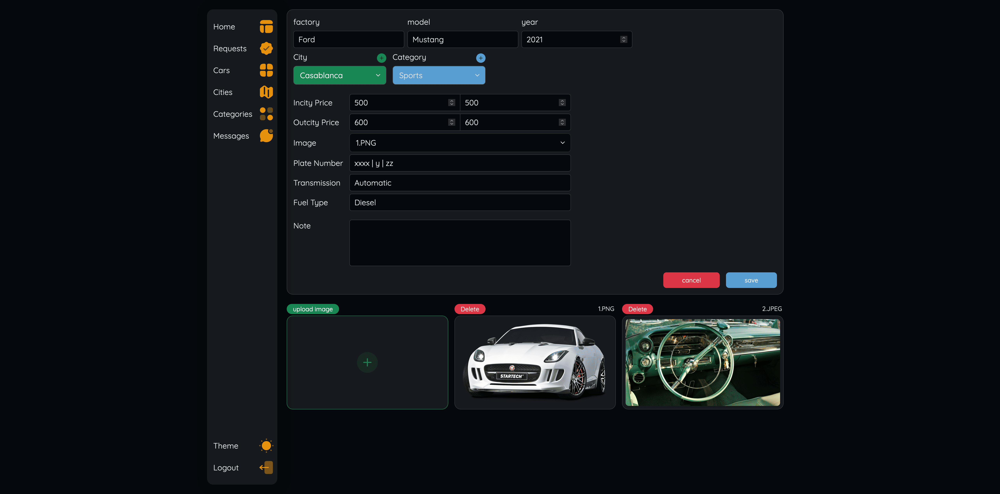
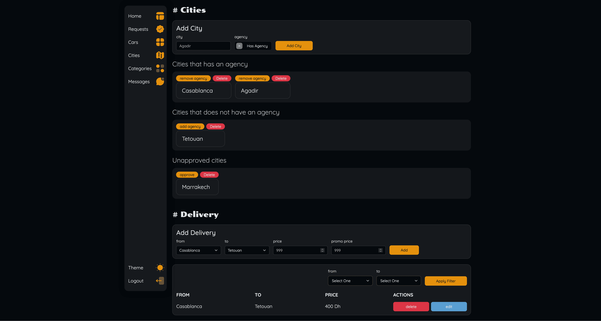

# Aniza

## A simple car rental website with easy booking and a range of vehicles to choose from.

> **Note**: The source code for this project cannot be shared as it is part of an enterprise project with confidentiality restrictions.

## Screenshots

### Home: 

### Cars: 

### Contact: 

### About: 

### Car Details: 

### Request Form (part 1): 

### Request Form (part 2): 

### Reservation Details (part 1): 

### Reservation Details (part 2): 

### Dashboard Home: 

### Dashboard Requests: 

### Dashboard Cars: 

### Dashboard Car Details: 

### Dashboard Create Car: 

### Dashboard Edit Car: 

### Dashboard Cities: 

### Dashboard Categories: 

### Dashboard Messages: 

